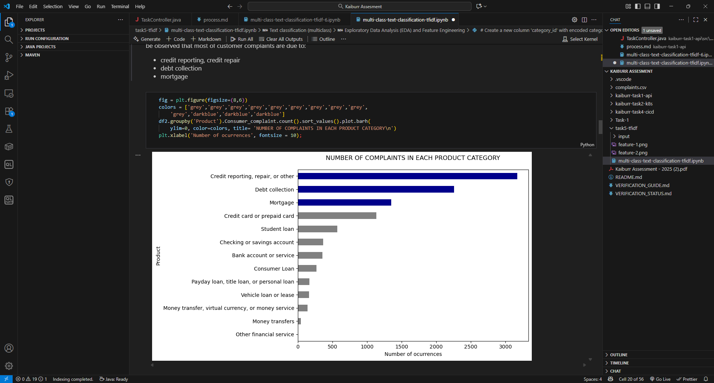
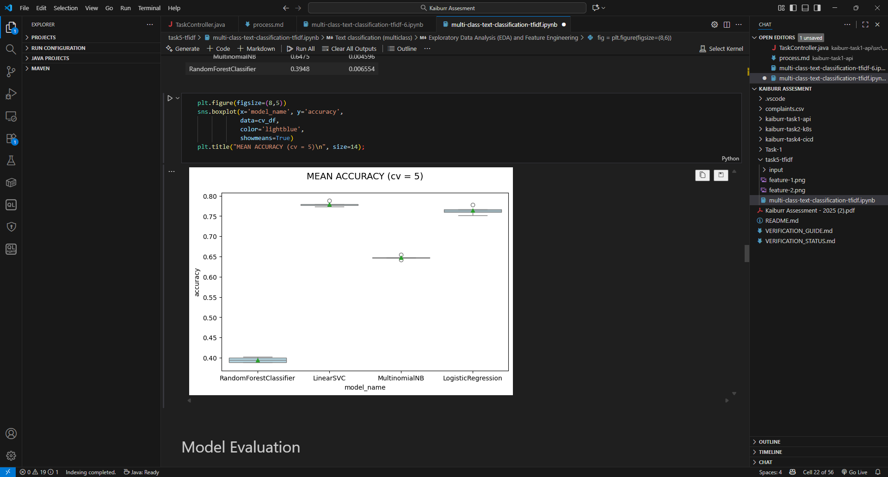
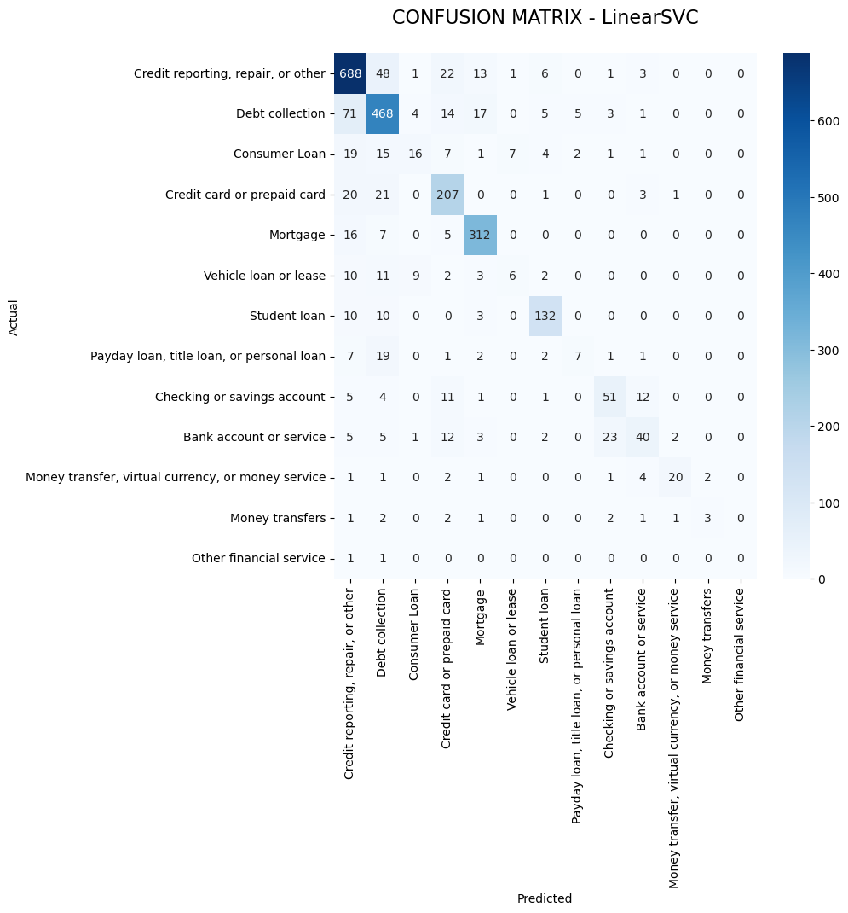

# Task 5: Data Science Text Classification

## Overview

This repository contains the solution for Task 5 of the Kaiburr Assessment 2025: **Multi-Class Text Classification on the Consumer Complaint Dataset** using modern machine learning techniques.

***

## Dataset

- **Location:** `input/rows.csv`
- **Description:** Contains over one million rows of real-world consumer complaints about various financial products and services in the US.
- **Selected Columns:** 
    - `Product` (category label)
    - `Consumer complaint narrative` (complaint text)

***

## Solution Approach

### 1. Data Loading & Preprocessing

- Loaded dataset and selected key columns.
- Dropped rows with missing complaint text for data cleanliness.
- Merged similar categories to reduce ambiguity.
- Final curated dataset: ~380,000 complaints across 13 categories.

*Screenshot: Data loading & cleaning*  

### 2. Feature Engineering

- Converted complaint texts into numerical vectors using **TF-IDF**.
- Provided models a representation to learn from text patterns.

*Screenshot: TF-IDF transformation*  
 Model Training

- Compared multiple algorithms:
    - Linear SVM
    - Random Forest
    - Multinomial Naive Bayes
    - Logistic Regression
- Used 75/25 train-test split for evaluation.

*Screenshot: Model training & comparison*  

***

### 4. Model Evaluation

- Reported **accuracy**, **precision**, **recall**, **F1-score**.
- Visualized confusion matrix to analyze class-wise performance.

*Screenshot: Metrics and confusion matrix*  

***

### 5. Sample Predictions

- Displayed prediction examples for new complaints.
- Demonstrated model’s ability to generalize.

*Screenshot: Sample predictions*  

All screenshots include:
- The **current datetime** (system widget visible)

*All screenshots are saved in `img/` and embedded into this README as required by Kaiburr assessment guidelines.*

***

## How to Run

1. Clone this repository.
2. Place dataset as `input/rows.csv`.
3. Open `multi-class-text-classification-tfidf.ipynb` with Jupyter/Kaggle.
4. Run all cells to reproduce results.

***

## Result Highlights

- Highest accuracy for frequent complaint categories.
- Key confusions among similar financial product categories.
- Models generalize well on previously unseen complaints.

***

## Author

**SAI TEJAS MAREDDY**  
Amrita University

***

## Submission Compliance

- All code and steps are original and performed solely by the author.
- Screenshots meet the Kaiburr requirements.
- For evaluation, please check README and the `img/` directory for all required illustration proofs.

